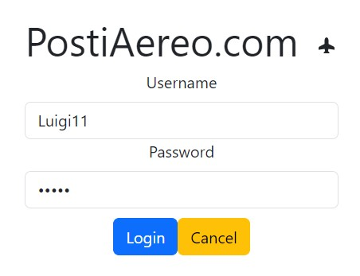
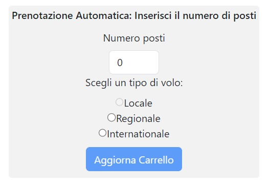
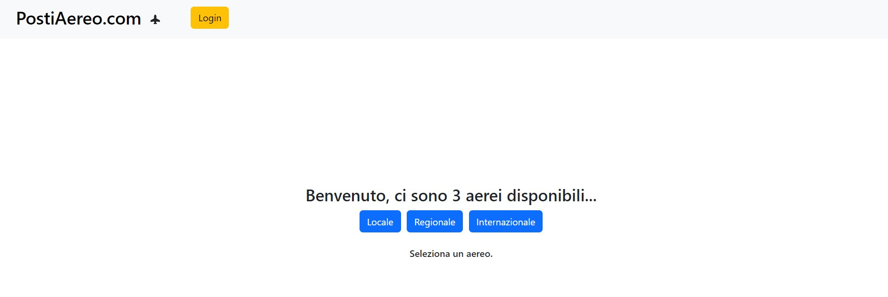
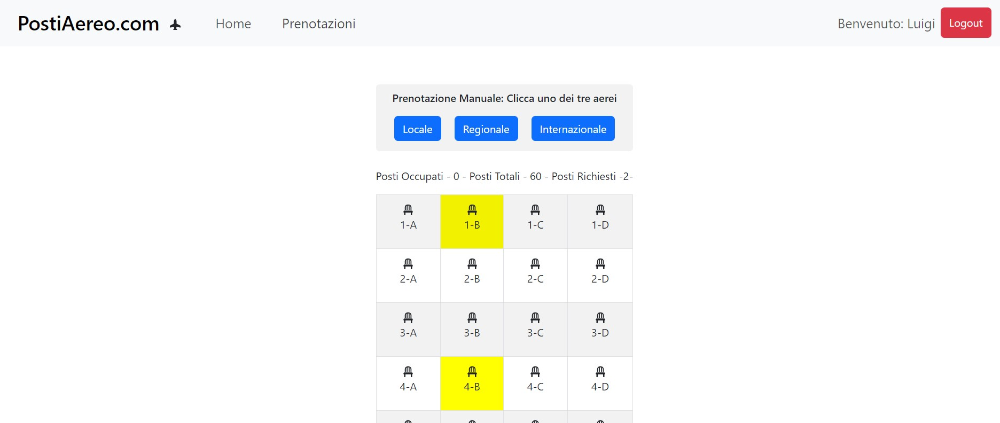
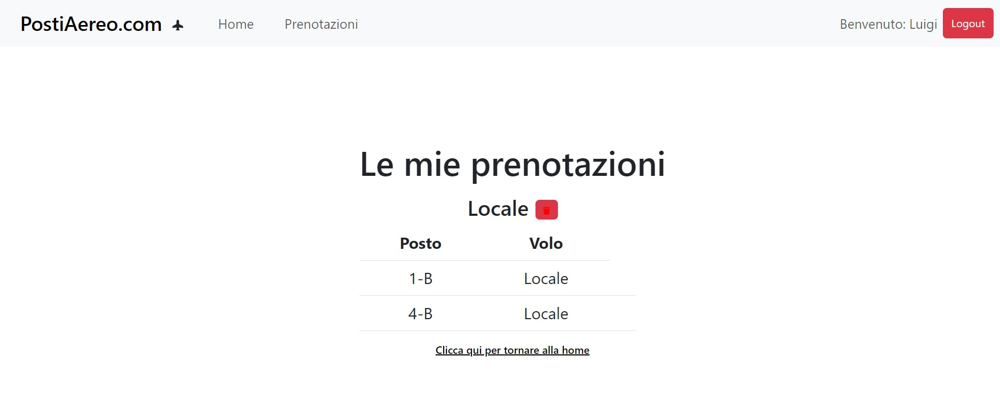

# Exam #12345: "Posti Aereo"
## Student: Emiz25 

## React Client Application Routes

- Route `*`: Route per le pagine che non esistono
- Route `/`: Pagina Home che contiene la visualizzazione dei posti per gli utenti non loggati.
- Route `/HomeUserLogged`: Pagina Home per gli utenti loggati che permette di aggiungere delle prenotazioni manuali e       automatiche.
-  Route `/login`: Pagina per il login.
-  Route `/BookedFlights`: Pagina per visualizzare le prenotazioni attive, con la possibilità di poterle cancellare.

## API Server

- GET `/api/locseats`
  - Mostra i posti relativi al volo "Locale" con numero di posti liberi e occupati.
  - Essendo una GET non ho body
- GET `/api/regseats`
  - Mostra i posti relativi al volo "Regionale" con numero di posti liberi e occupati.
  - Essendo una GET non ho body 
- GET `/api/intseats`
  - Mostra i posti relativi al volo "Internazionale" con numero di posti liberi e occupati.
  - Essendo una GET non ho body
- POST `/api/casual/`
  - Restituisce dei posti casuali dato un contatore e un tipo di aereo, inoltre verifica se il contatore passato è plausibile o no a seconda del tipo di aereo, in caso negativo restituisce un errore con il limite massimo di posti selezionabili.
  - Nel body è contenuto il contatore dei posti scelti e il tipo di aereo.
- GET `/api/myflights/`
  - Mostra i posti prenotati dall'utente.
  - Essendo una GET non ho body
- PUT `/api/edit/`
- Modifica la tabella sfruttando il fatto che una modifica può essere fatta sia per assegnare un posto che per eliminarlo, il tutto si basa sul modificare i parametri. All'interno viene fatto un ulteriore check per verificare se altri utenti hanno prenotato un posto in contemporanea, dopo aver controllato la risposta, se priva di errori, viene modificato il posto.
- Nel body sono contenuti i posti/o selezionati/o, un flag di tipologia che indica se voglio eliminare o modificare e un altro flag che mi serve per occupare o liberare il posto.
- POST `/api/sessions`
  - Inizializza la sessione, in caso di successo viene effettuato il login, in caso contrario vengono mostrati gli errori.
  - Il body contiene l'utente da autenticare dove si utilizzano username e password
- DELETE `/api/session/current`
  - Effettua il logout dalla sessione corrente eliminandola
- GET `/api/session/current`
  - Ritorna l'utente autenticato al momento se esiste, altrimenti avvisa che l'utente non è autenticato
  - Essendo una GET non ho body

## Database Tables

- TABLE `users` ( "userID", "username" , "hash" , "salt" , "name" , PRIMARY KEY("userID" AUTOINCREMENT) )
- TABLE `flights` ( "flightID" , "name" , PRIMARY KEY("flightID") )
- TABLE `places` ( "placeID" , "row" , "position" , "occupied" , "userID" , "flightID" , PRIMARY KEY("placeID"),  FOREIGN KEY("userID") REFERENCES "users"("userID") )

## Main React Components

- `Booked` (in `Bookedflightscomponents.jsx`): Componente per visualizzare le prenotazioni effettuate. Viene chiamata l'API per visualizzare le prenotazioni dell'utento, poi vengono convertiti i voli da numero a lettera (o viceversa) per essere visualizzati correttamente sul sito.
Vengono poi sistemati in tre diverse tabelle, una per volo. 
- `Carrello` (in `Carrello.jsx`): Componente per visualizzare (e poi acquistare) i voli. Viene effettuata l'aggiunta al carrello tramite un settaggio di stati passati come props, poi con la funzione acquista viene chiamata l'API per acquistare, se quest'ultima va a buon fine si viene indirizzati nella pagina dei voli prenotati, se quest'ultima non va a buon fine (i posti sono stati prenotati nel mentre da un altro utente), viene gestita la schermata momentanea che avvisa l'utente dell'errore e vengono settati in rosso i posti che non sono più disponibili.
- `Seats` (in `Homeloggedcomponents.jsx`):  Componente per la generazione e la selezione dei posti che provvederà ad assegnare col colore giallo i posti richiesti, mentre saranno rossi e non cliccabili i posti di colore rosso.
- `Main` (in `Homeloggedcomponents.jsx`): Componente che mi permette si settare, mediante un flag, delle API che scatteranno nel caso della selezione manuale, mentre nel caso della selezione automatica chiamerà l'API interessata che genererà dei posti che poi verranno passati come props al carrello.
- `LogInRoute` (in `Loginroute.jsx`): Componente che realizza il login. 
- `MyHeader` (in `Navbarcomponents.jsx`): Componente per la realizzazione della navbar, contiene anche un pulsante per il login che si aggiorna diventando logout quando si è già loggati.
- `NotFoundPage` (in `NotFoundPage.jsx`): Componente che torna una scritta di pagina non valida quando si cerca di andare su route non definite.

(only _main_ components, minor ones may be skipped)

## Screenshot

## Users Credentials

- Username: Mary12, Password: mary 
- Username: Luigi11, Password: luigi 
- Username: Mario00, Password: mario 
- Username: Simone99, Password: simone 

